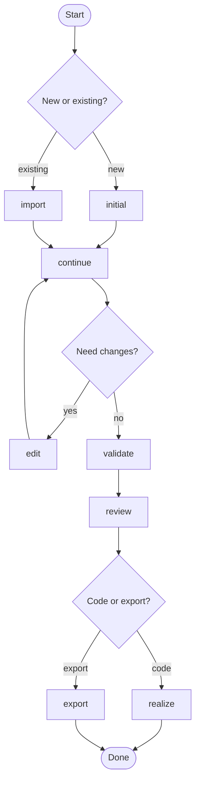

# About

Agent skill for a component-based technical design. It creates a design directory and a root document, then walks requirements, solution cards, review, and validation before implementation.

# Process map




| Process              | When it runs                                    |
| -------------------- | ----------------------------------------------- |
| `initial` / `import` | Start a new design, or bring in an existing one |
| `continue`           | Design requirements and solutions               |
| `edit`               | Change the design or related components         |
| `validate`           | Check completeness, diagrams, and wording       |
| `review`             | Check that solutions meet the requirements      |
| `realize` / `export` | Write the code, or export the design            |


# Quick Start

```
npm install -g @ilsrk/technical-design@latest

```

